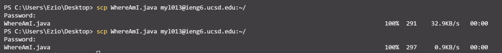
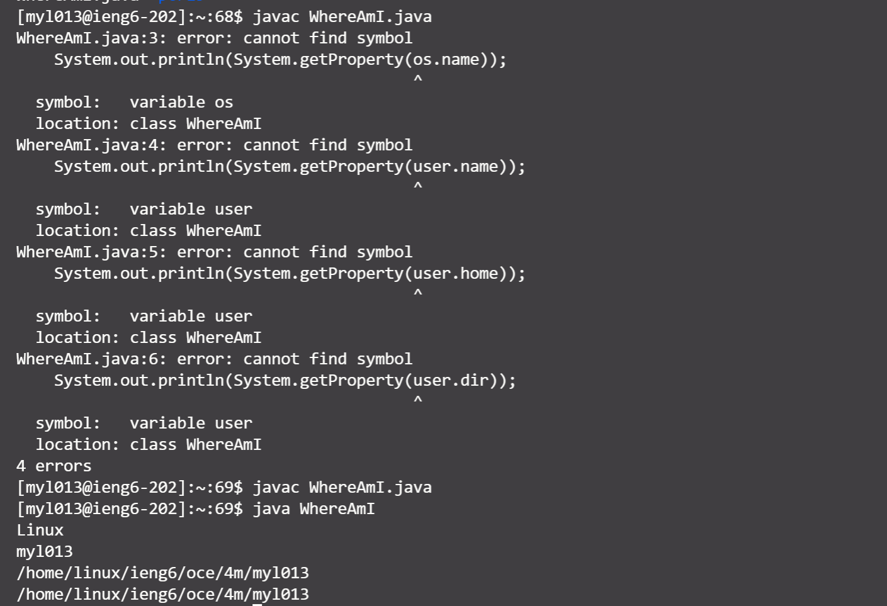
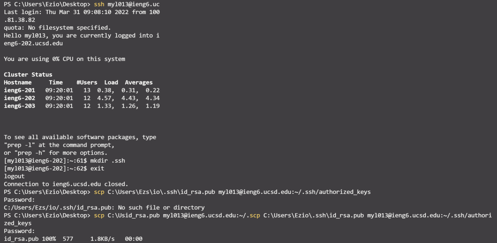

# Welcome to Anthony's Lab Report

In this report is a tutorial for incoming 15L students. It will tell you how to log into account on ieng6.

**Note**: I accidentally used my email username to logged in but it still works. I realized it at the end of lab. So the screenshot I took includes my email username but not my 15L username. I know and I will use my 15L username to connect to server in the future !!!

## Installing VScode

**The steps I took to install VScode**
* Step 1: I went to the [Visual Studio Code website](https://code.visualstudio.com/)
* Step 2: I found the VS code version that fits my operating system
* Step 3: I followed the instruction to install

**Here is the page should see if installed vs code properly.**

---
## Remotely Connecting

**The steps I took to connect to the server**
* Step 1: Open a terminal in VS code OR Open a command panel in Windows
* Step 2: Type in "ssh your_user_name@ieng6.ucsd.edu
* Step 3: I saw a message looks like this
> Are you sure you want to continue connecting (yes/no/[fingerprint])?
Then I typed yes
* Step 4: I typed in my password and pressed ENTER (I noticed that my password will no appear on my screen for safty reason)

**Here is the page shoudl see if connected to the server**

---
## Trying Some Commands

**The steps I took to try some command**
* Step 1: I firstly followed the instruction in Remotely Connecting to connect to the ieng6 server
* Step 2: I typed in command in the command line.
* Step 3: Then I remembered the functions of the command line

**Here are some examples:**

---
## Moving Files with scp

**The steps I took to upload and run WhereAmI file**
* Step 1: I realized that I do not need to connect to the server to upload the file
* Step 2: Then, I used the command scp to upload my file to the server (The first picture in this unit)
* Step 3: However, when I used javac for the first time , I encountered four errors. After comparing my code with my groupmate, he helped me find out that my code is not correct, missing four pairs of “”. After fixing the error and uploading the file again, my code ran successfully.(The second picture in this unit)

**Here is how you should use scp to upload a file:**

**The problem I met and my code after fixing the code**

---
## Setting an SSH Key

**The steps I took to set up an SSH Key**
* Step 1: I run the code `ssh-keygen` on my own computer
* Step 2: Then I followed the instruction to save the generated keys and no to add a passphrase for the public key. (See the first picture in this unit)
* Step 3: Then I copied the public key in on my computer to ieng6server(See the second picture)
* Step 4: Finnaly, I do not need passcode to log in to the server on my computer as shown in the second picture

**The process of getting key and copy public key to the server**

---
## Optimizing Remote Running

**The steps I took to set up an SSH Key**
* Step 1: I firstly connected to the server to check the files exist in my server
* Step 2: I followed the instruction to type in the command to copy WereAmI to OtherMain and run javac and java. I succeed.
* Step 3: I tried using up arrow to recall the last command. 

**Step 2 and Step 3 I tried**

**The End.**