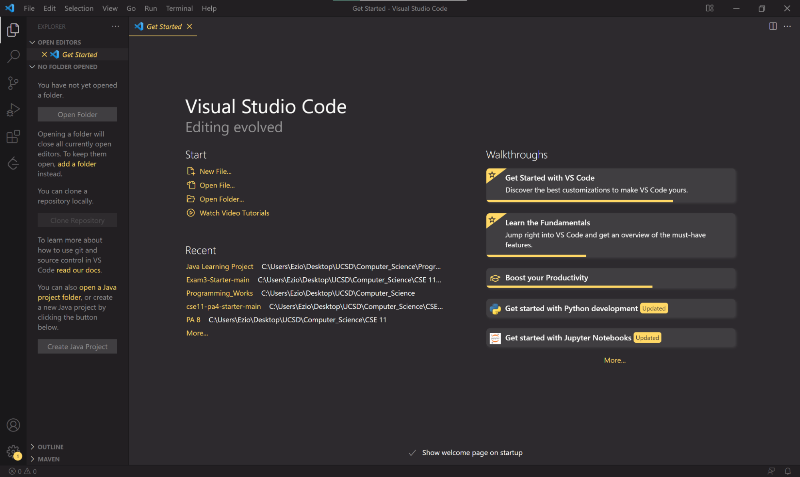
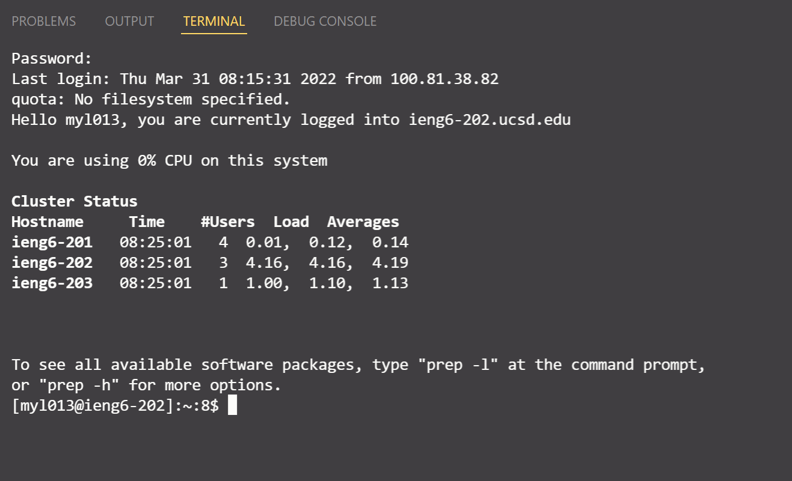
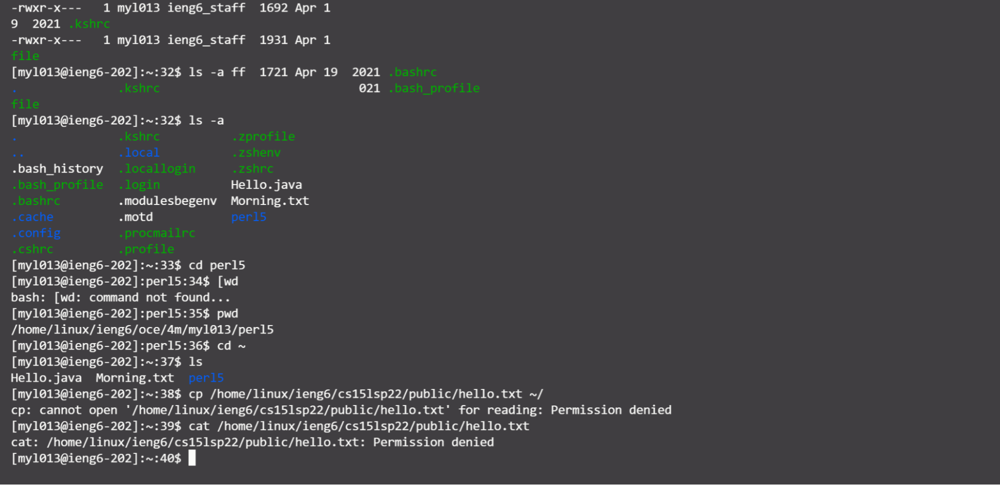
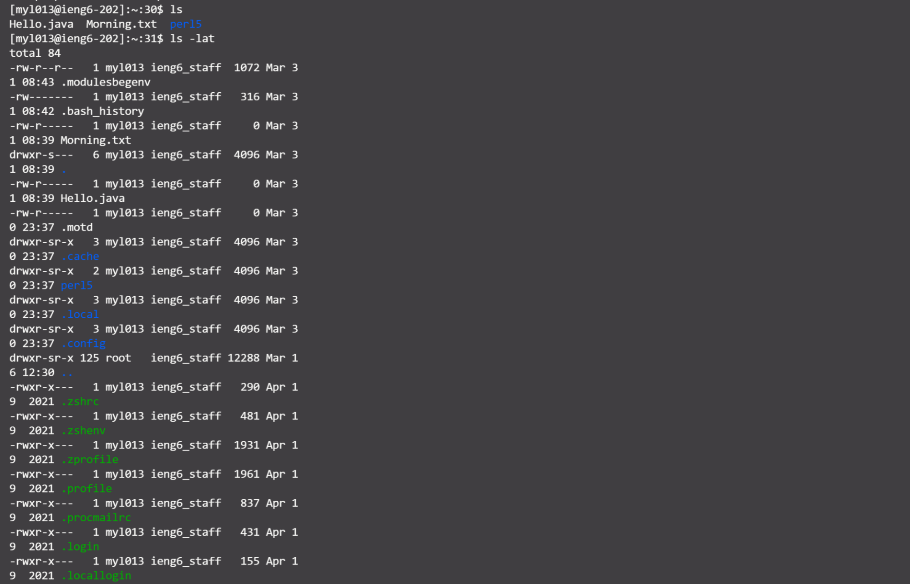

# Welcome to Anthony's Lab Report

In this report is a tutorial for incoming 15L students. It will tell you how to log into account on ieng6.

---
## Installing VScode

* Step 1: Go to the [Visual Studio Code website](https://code.visualstudio.com/)
* Step 2: Find the VS code version that fits your operating system
* Step 3: Follow the instruction to install

**Here is the page you should see if you install vs code properly.**

---
## Remotely Connecting

* Step 1: Open a terminal in VS code OR Open a command panel in Windows
* Step 2: Type in "ssh your_user_name@ieng6.ucsd.edu
* Step 3: If you see a message looks like this
> Are you sure you want to continue connecting (yes/no/[fingerprint])?
type yes
* Step 4: Type in your password and press ENTER (your password will no appear on your screen for safty reason)

**Here is the page you shoudl see if you have connected to the server**

Note: I accidentally used my email username to logged in but it still works. I realized it at the end of lab. So the screenshot I took includes my email username but not my 15L username. Please use your 15L username to connect.

---
## Trying Some Commands

* Step 1: Follow the instruction in Remotely Connecting to connect to your server
* Step 2: Type in command in the command line.
* Step 3: Think about the functions of the command line

**Here are some examples:**

---
## Moving Files with scp

---
## Setting an SSH Key

---
## Optimizing Remote Running
